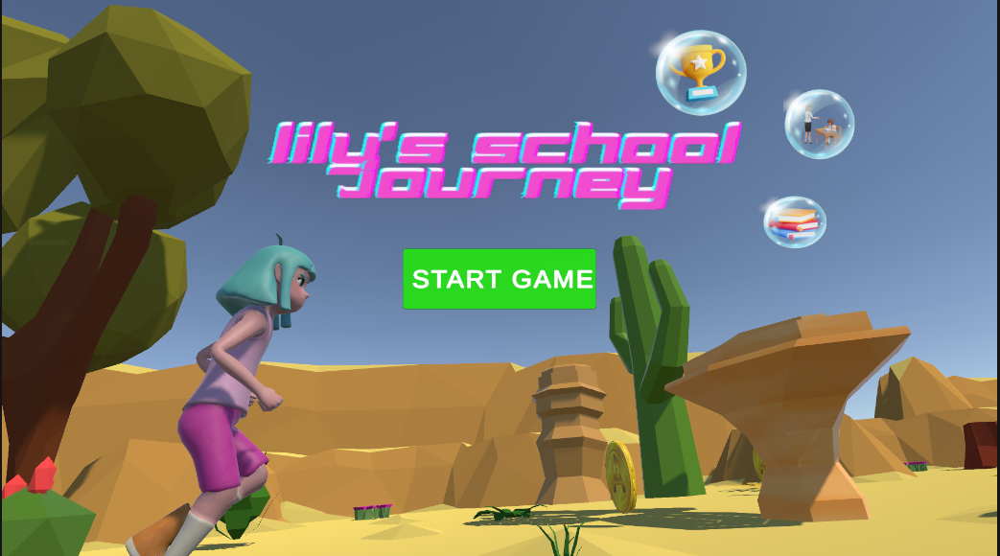
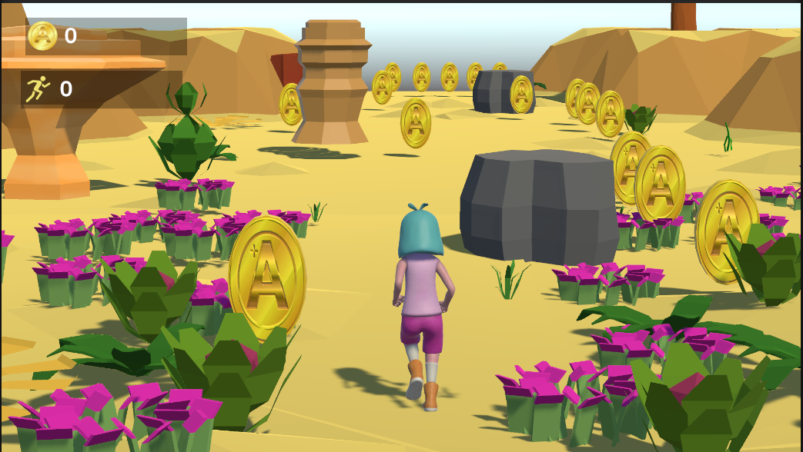
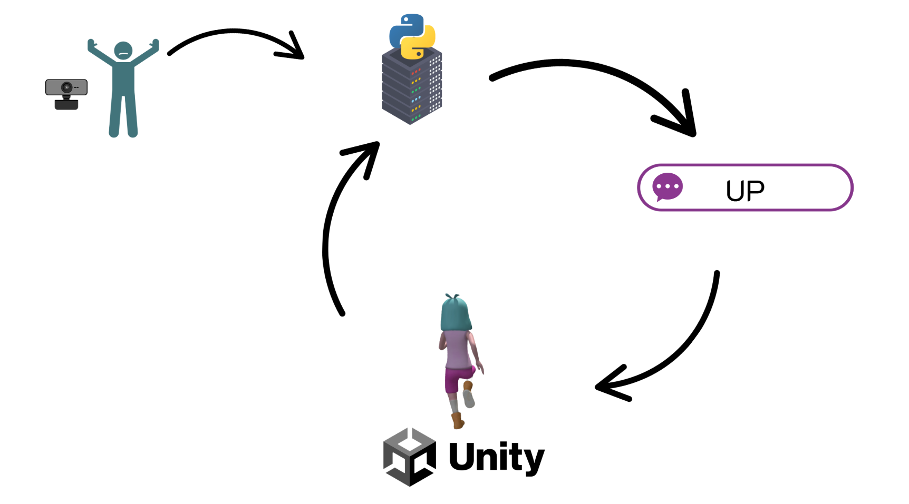

# Trò chơi Endless Runner điều khiển bằng cử chỉ nhận diện qua Mediapipe Pose
Sử dụng C# và Python

## Giao diện
Dưới đây là một số hình ảnh minh họa giao diện của trò chơi:

<table>
  <tr>
    <td align="center">
      
    </td>
    <td align="center">
      
    </td>
</table>

## Nguyên lí hoạt động
<table>
  <tr>
    <td align="center">
      
    </td>
    <td align="center">
      
    </td>
  </tr>
</table>
